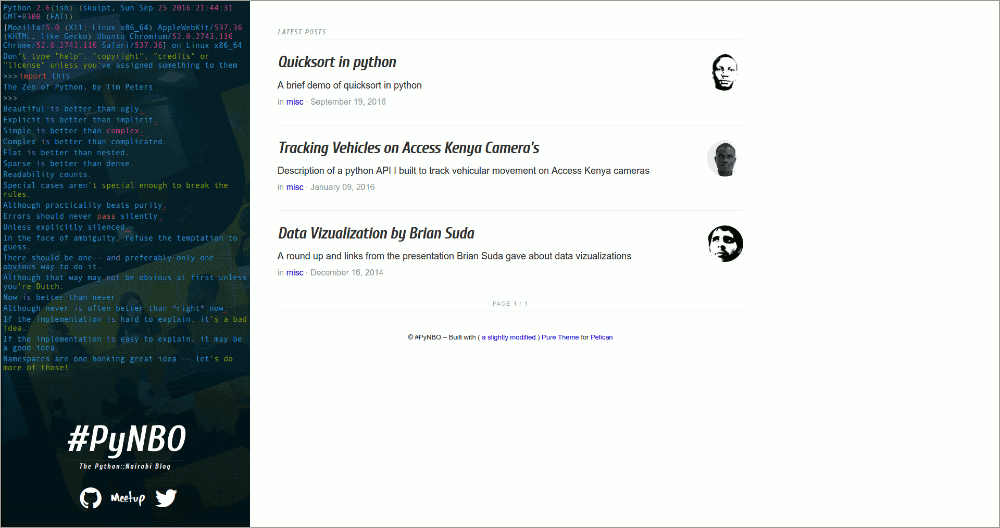
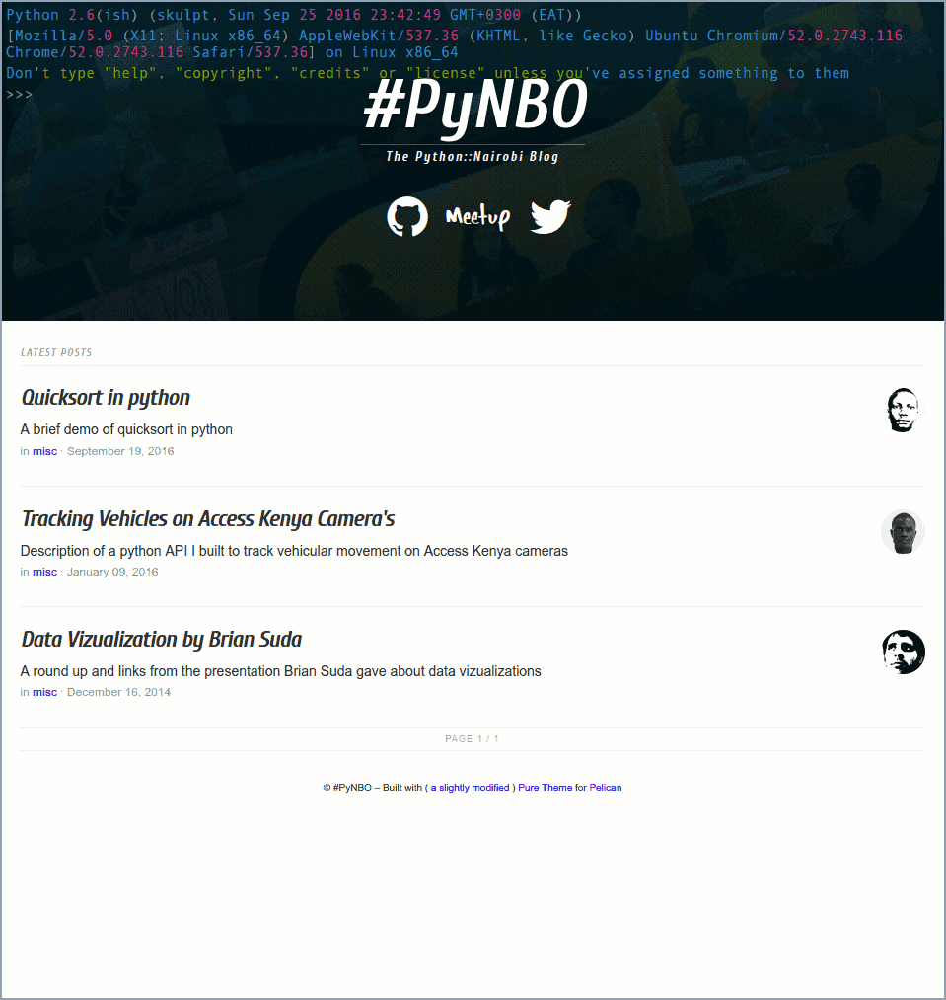
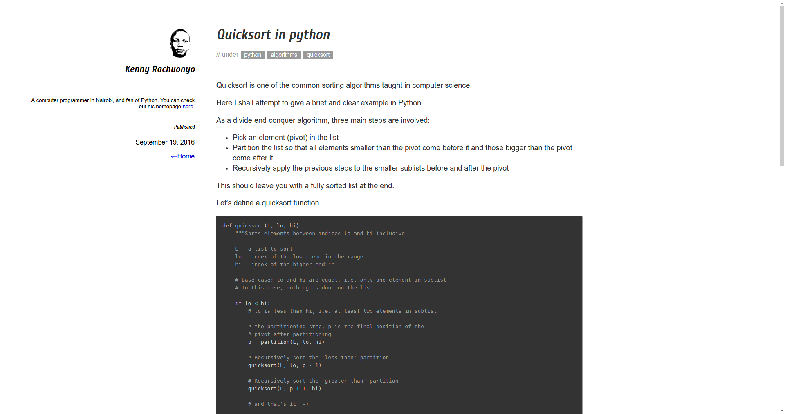

Pure-PyNBO
====

A slightly modified [Pure theme](https://github.com/PurePelicanTheme/pure) based on [Purecss](http:purecss.io) for [Pelican](http://docs.getpelican.com/) blawgs.

It features a fully fledged in-browser implementation of python complete with a REPL/interactive shell courtesy of [Skulpt](http://www.skulpt.org/) and [CodeMirror](https://codemirror.net/) wrapped by [CodeMirrorREPL](https://github.com/aaditmshah/codemirror-repl).

See it all in action here:- <http://blog.pynbo.or.ke>. Give the interpreter a go. Report any fails.

## PREVIEW

## CONTRIB

1. [Fork](Python-Nairobi/pure-pynbo#fork-destination-box)
2. H4x H4x H4x Commit Push
3. Make a pull request against Python-Nairobi/pure-pynbo:master
4. We merge
5. ????
6. PROFIT!!!!
